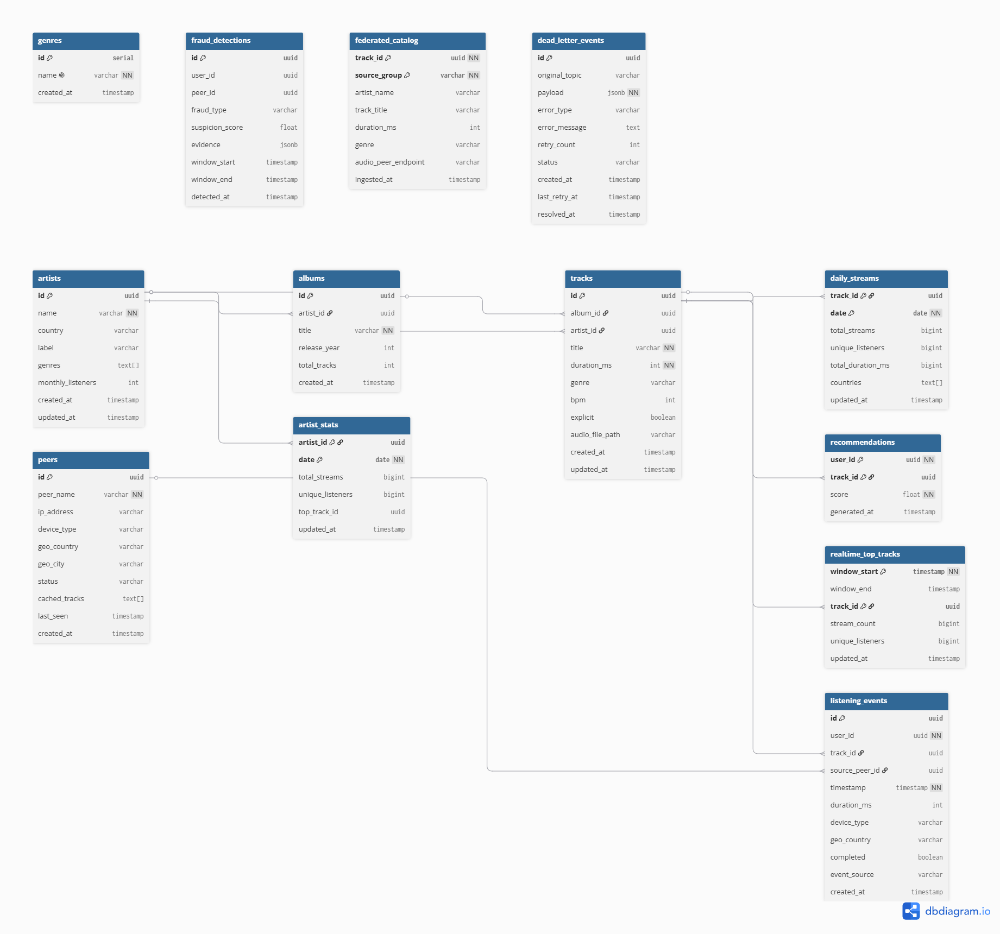

## Diagramme ERD

Diagramme réalisé avec dbdiagram.io

## Pourquoi deux index sur listening_events ?

listening_events est la table la plus grosse qui fait référence à chaque événement d'écoute et chaque écoute crée une ligne, elle peut avoir des millions de lignes. 

## Index sur timestamp : 
Sert pour les recherches par plage et il va directement aux bonnes lignes, sans cet index PostgreSQL lit toutes les lignes une par une. 
Exemple : 
-- "donne moi tous les événements entre 14h et 15h"
WHERE timestamp BETWEEN '14:00' AND '15:00'

## Index sur date_trunc('hour', timestamp) : 
Sert pour les agrégations par heure, il calcule et stocke directement les valeurs, sans cet index PostgreSQL recalcule date_trunc() sur chaque ligne.
Exemple : 
-- "combien d'écoutes par heure ?"
GROUP BY date_trunc('hour', timestamp)

## La différence entre daily_streams et realtime_top_tracks ?

Les deux servent tous les deux à analyser les écoutes Spotify, mais avec des objectifs différents : 

La table daily_streams est alimentée par Airflow une fois par jour et contient les données complètes et exactes de la journée précédente, ce qui la rend adaptée aux calculs de royalties, aux statistiques officielles et aux rapports analytiques. 
À l’inverse, realtime_top_tracks est alimentée en continu par Spark Streaming toutes les 5 minutes afin d’afficher les morceaux les plus écoutés en temps réel. Ces données sont plus rapides mais peuvent être approximatives à cause des retards de réception de certains événements.

En résumé, daily_streams représente le bilan fiable et consolidé du lendemain, tandis que realtime_top_tracks correspond à un classement live évoluant en permanence.

## Pourquoi dead_letter_events.payload est JSONB plutôt que TEXT ?

La Dead Letter Queue stocke des événements défectueux qu'on veut pouvoir rejouer et analyser.
Avec TEXT on stocke une chaîne opaque, exemple de recherche :
" WHERE payload LIKE '%user_id%' ", qui est très lent et approximatif et impossible de chercher à l'intérieur du contenu.

Avec JSONB on peut chercher dans le contenu, exemple de recherche : 
" WHERE payload->>'user_id' = 'abc-123' ", qui permet de trouver tous les événements défectueux d'un user. 

## 3 avantages concrets de JSONB :

- Requêtes sur les champs internes
- Index possible sur le contenu JSON
- Validation automatique — PostgreSQL rejette un JSON malformé à l'insertion

